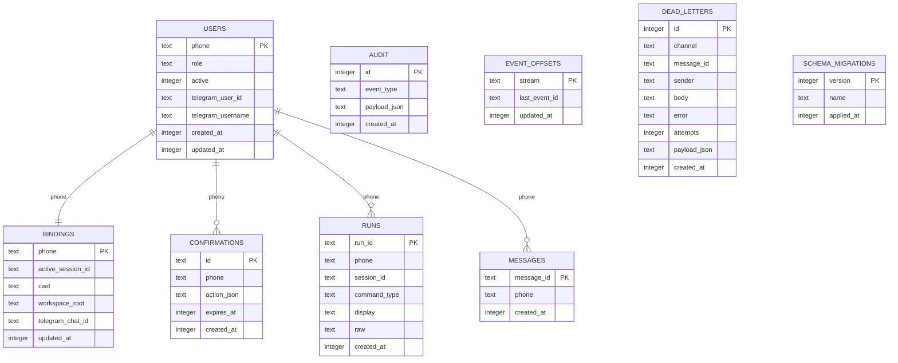

# Database ERD

## Notes

- `bindings.active_session_id` maps users to OpenCode sessions.
- `confirmations.action_json` stores serialized intent payloads for dangerous action approval.
- `runs` is a retrieval cache for channel-friendly output lookup (`/runs`, `/get`).
- `event_offsets` supports durable stream checkpointing for OpenCode global events.
- `dead_letters` captures failed inbound updates after retry exhaustion.
