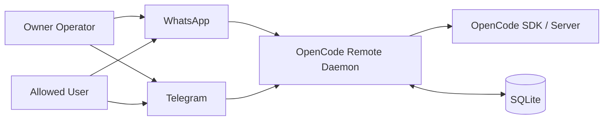

# System Context

## Purpose

Show the external actors and systems that interact with OpenCode Remote.

## Source files

- `src/index.ts`
- `src/transport/whatsapp.ts`
- `src/transport/telegram.ts`
- `src/adapter/opencode.ts`
- `src/storage/sqlite.ts`

## Diagram

## Key invariants

- OpenCode remains the source of truth for session execution and permissions.
- SQLite is the source of truth for local control-plane state.
- Transport channels are interchangeable input/output paths over one command model.

## Failure modes

- Transport unavailable (WhatsApp disconnected, Telegram webhook/polling failure).
- OpenCode SDK/server unavailable.
- SQLite unavailable or migration failure at startup.

## Operational checks

- `npm run cli -- status`
- `npm run cli -- logs 30`
- `npm run cli -- deadletters 20`

## Related pages

- `docs/architecture/02-containers.md`
- `docs/wiki/Architecture/System-Overview.md`
