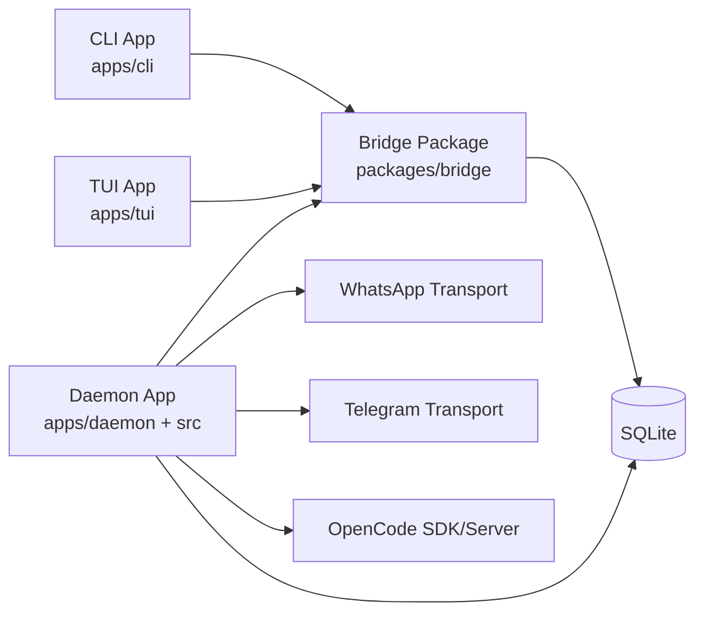

# Container Diagram

## Purpose

Show deployable/runtime containers in the monorepo and how they collaborate.

## Source files

- `apps/daemon/src/index.ts`
- `apps/cli/src/index.ts`
- `apps/tui/src/index.ts`
- `packages/bridge/src/index.ts`
- `src/index.ts`

## Diagram

## Key invariants

- CLI/TUI consume shared bridge contract, not daemon internals.
- Daemon owns transport orchestration and command execution.
- DB schema is shared operationally, but bridge uses read/write task APIs.

## Failure modes

- Bridge task failure from invalid config or DB lock contention.
- Workspace resolution errors if package exports are broken.

## Operational checks

- `npm run cli -- help`
- `npm run tui`
- `npm run verify`

## Related pages

- `docs/architecture/03-components.md`
- `docs/wiki/Development/Monorepo-Structure.md`
