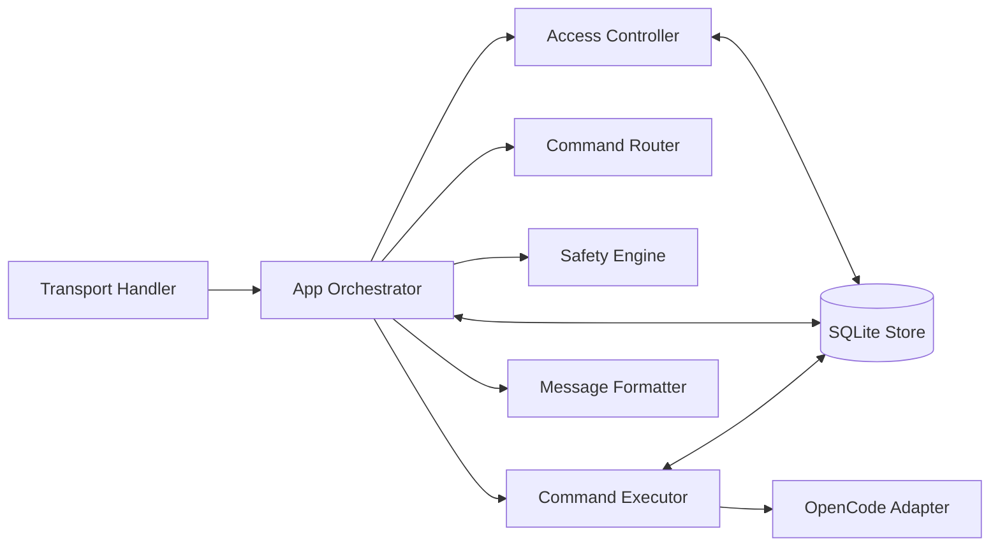

# Component Diagram

## Purpose

Describe daemon internals that transform a message into an executed result.

## Source files

- `src/index.ts`
- `src/router/index.ts`
- `src/commands/executor.ts`
- `src/adapter/opencode.ts`
- `src/access/controller.ts`
- `src/safety/engine.ts`
- `src/presentation/formatter.ts`
- `src/storage/sqlite.ts`

## Diagram

## Key invariants

- Router decides intent; executor performs intent.
- Safety checks run before dangerous command execution.
- Store operations are centralized through `LocalStore` and controller abstractions.

## Failure modes

- Parser mismatch creates incorrect intent.
- Adapter boundary shape mismatch from SDK response changes.
- Safety false positive blocks valid command.

## Operational checks

- `npm test -- tests/router.test.ts`
- `npm test -- tests/executor.test.ts`
- `npm test -- tests/adapter.test.ts`

## Related pages

- `docs/wiki/Architecture/Request-Lifecycle.md`
- `docs/wiki/Integrations/OpenCode-SDK-Boundary.md`
