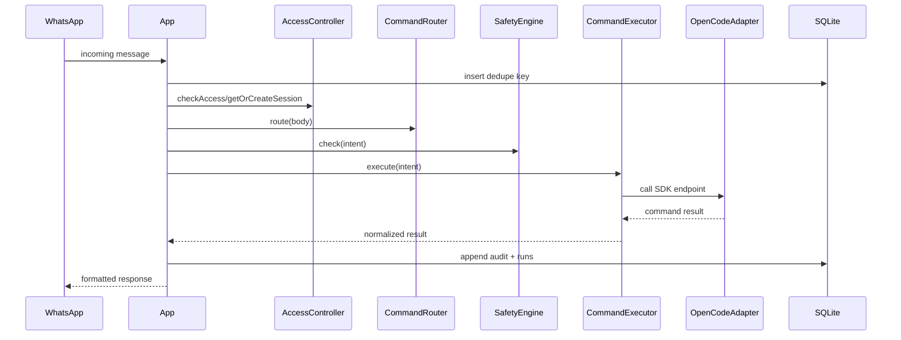

# Sequence: WhatsApp Inbound Command Path

## Purpose

Trace an inbound WhatsApp message through dedupe, policy, execution, persistence, and response.

## Source files

- `src/transport/whatsapp.ts`
- `src/index.ts`
- `src/router/index.ts`
- `src/commands/executor.ts`
- `src/storage/sqlite.ts`

## Diagram

## Key invariants

- Dedupe happens before expensive execution.
- Dangerous flows require confirmation before execution.
- Runs and audit data persist after each accepted command.

## Failure modes

- Duplicate transport message ID ignored.
- Access denied for non-allowlisted senders.
- Transport send failure after successful execution.

## Operational checks

- `npm test -- tests/telegram.test.ts`
- `npm test -- tests/storage.test.ts`

## Related pages

- `docs/architecture/08-state-message-lifecycle.md`
- `docs/wiki/Architecture/Request-Lifecycle.md`
