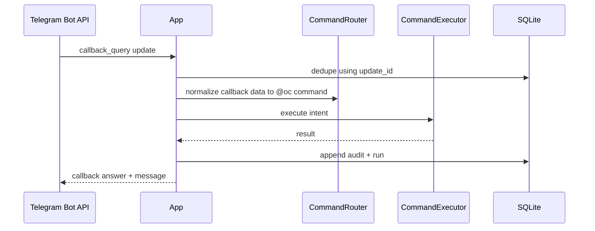

# Sequence: Telegram Callback Path

## Purpose

Show callback updates from inline Telegram actions mapped into shared command handling.

## Source files

- `src/transport/telegram.ts`
- `src/index.ts`
- `src/router/index.ts`

## Diagram

## Key invariants

- `update_id` is the callback dedupe identity.
- Callback aliases map to the same `@oc` grammar as text input.

## Failure modes

- Invalid callback payload.
- Non-private chat callback blocked by policy.

## Operational checks

- `npm test -- tests/telegram.test.ts`

## Related pages

- `docs/wiki/Integrations/Telegram.md`
- `docs/wiki/Architecture/Control-Plane-Namespaces.md`
