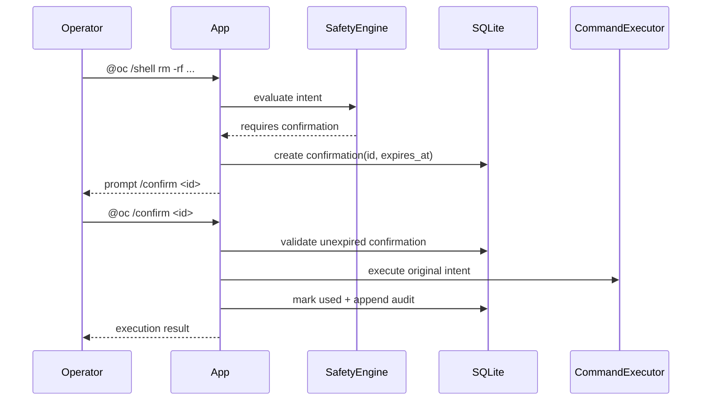

# Sequence: Dangerous Command Confirmation Flow

## Purpose

Document the two-step confirmation required for dangerous command intents.

## Source files

- `src/safety/engine.ts`
- `src/index.ts`
- `src/storage/sqlite.ts`

## Diagram

## Key invariants

- Dangerous command execution requires a valid pending confirmation.
- Confirmations expire and cannot be reused.

## Failure modes

- Confirmation expired.
- Confirmation ID not found.

## Operational checks

- `npm test -- tests/safety.test.ts`

## Related pages

- `docs/architecture/10-state-confirmation-lifecycle.md`
- `docs/wiki/Security/Safety-Engine-and-Confirmations.md`
