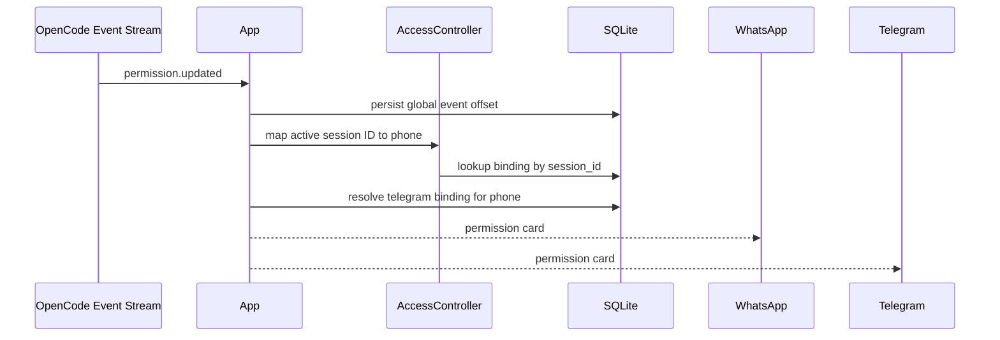

# Sequence: permission.updated Event Fan-out

## Purpose

Describe how OpenCode global permission events are mapped to user channels.

## Source files

- `src/adapter/opencode.ts`
- `src/index.ts`
- `src/access/controller.ts`
- `src/storage/sqlite.ts`

## Diagram

## Key invariants

- Event offsets persist to support restart continuity.
- Fan-out targets the mapped session owner; owner fallback is used when needed.

## Failure modes

- Session mapping missing for event session ID.
- One transport fails while another succeeds.

## Operational checks

- `npm run cli -- logs 100`
- `npm run cli -- flow 50`

## Related pages

- `docs/wiki/Architecture/Request-Lifecycle.md`
- `docs/wiki/Integrations/OpenCode-SDK-Boundary.md`
