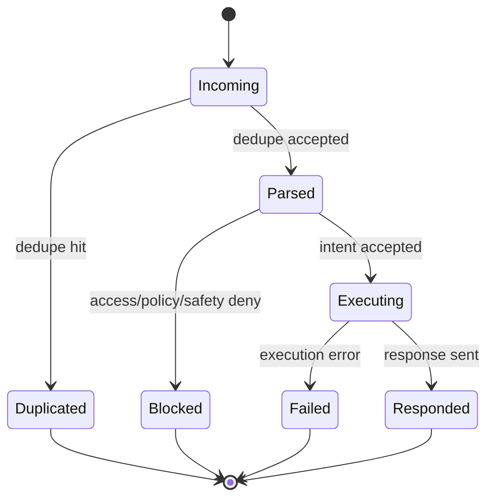

# State: Message Lifecycle

## Purpose

Define canonical message states from ingress to delivery/failure.

## Source files

- `src/index.ts`
- `src/storage/sqlite.ts`
- `src/transport/whatsapp.ts`
- `src/transport/telegram.ts`

## Diagram

## Key invariants

- Each inbound message reaches one terminal outcome.
- Duplicates terminate early with no side effects.

## Failure modes

- Post-execution send failure.
- Parsing failure on malformed command.

## Operational checks

- `npm run cli -- flow 100`

## Related pages

- `docs/wiki/Architecture/State-Machines.md`
- `docs/architecture/11-state-transport-retry-deadletter.md`
