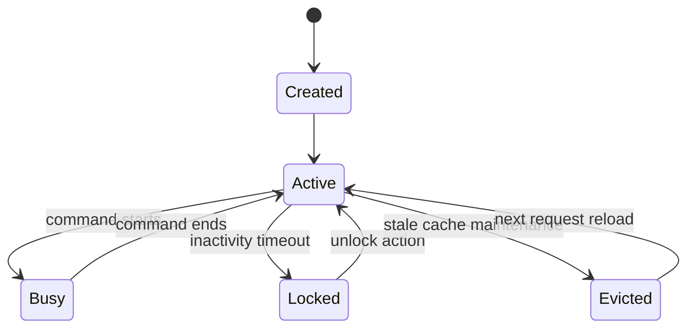

# State: Session Lifecycle

## Purpose

Capture how session records move through active/busy/locked/evicted states.

## Source files

- `src/access/controller.ts`
- `src/index.ts`

## Diagram

## Key invariants

- `bindings` remains the durable session context backing in-memory cache.
- Busy state blocks conflicting command execution.

## Failure modes

- stale session pointer to missing OpenCode session.
- unlock attempt from unauthorized actor.

## Operational checks

- `npm run cli -- status`
- `npm run cli -- logs 50`

## Related pages

- `docs/wiki/Architecture/State-Machines.md`
- `docs/wiki/Security/Access-Control-and-Policy.md`
