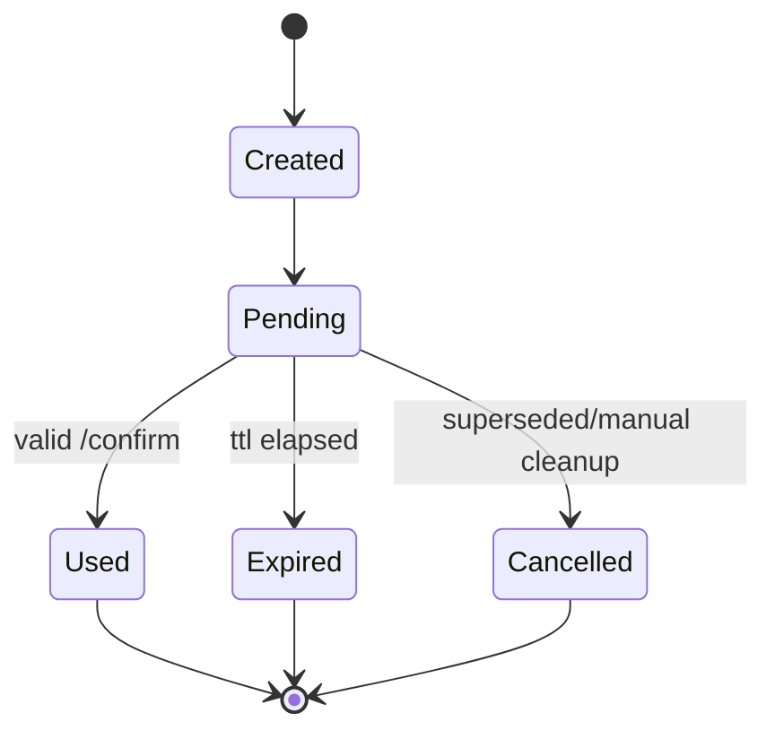

# State: Confirmation Lifecycle

## Purpose

Show the lifecycle of confirmation tokens used for dangerous actions.

## Source files

- `src/safety/engine.ts`
- `src/storage/sqlite.ts`
- `src/index.ts`

## Diagram

## Key invariants

- Confirmation IDs are single-use.
- Expired records are not executable.

## Failure modes

- replay attempt against used token.
- clock skew or stale cleanup delaying expiry enforcement.

## Operational checks

- `npm test -- tests/safety.test.ts`

## Related pages

- `docs/wiki/Security/Safety-Engine-and-Confirmations.md`
