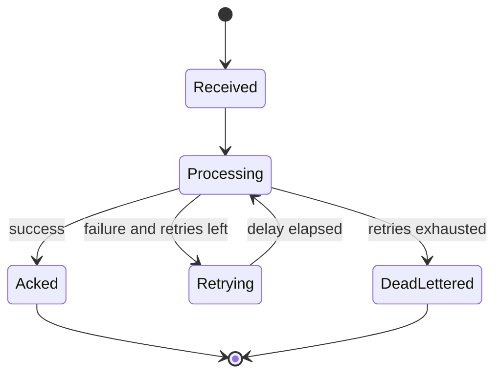

# State: Transport Retry and Dead-letter Lifecycle

## Purpose

Define retry progression for inbound transport processing failures.

## Source files

- `src/transport/whatsapp.ts`
- `src/transport/telegram.ts`
- `src/index.ts`
- `src/storage/sqlite.ts`

## Diagram

## Key invariants

- Retry budgets are bounded by transport config.
- Dead-letter payload is persisted with error context.

## Failure modes

- callback handler throws repeatedly.
- malformed payload cannot be normalized.

## Operational checks

- `npm run cli -- deadletters 50`

## Related pages

- `docs/wiki/Operations/Troubleshooting.md`
