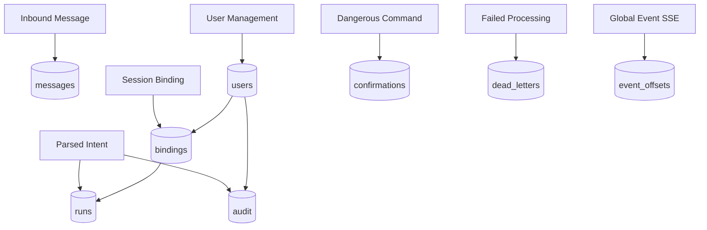

# Data Flow and Persistence

## Purpose

Map command/event data paths to SQLite tables and key relationships.

## Source files

- `src/storage/sqlite.ts`
- `docs/DATABASE_SCHEMA.md`
- `docs/ERD.md`

## Diagram

## Key invariants

- `messages` dedupe key enforces idempotency across channel/sender/message ID.
- `bindings` anchors phone-to-session/cwd/workspace and telegram chat mapping.
- audit and runs together provide explainability + retrieval.

## Failure modes

- migration drift between code and DB.
- stale bindings after external OpenCode session changes.

## Operational checks

- `npm run cli -- db info`
- `npm run cli -- db vacuum`

## Related pages

- `docs/wiki/Architecture/Data-Model-and-Persistence.md`
- `docs/DATABASE_SCHEMA.md`
