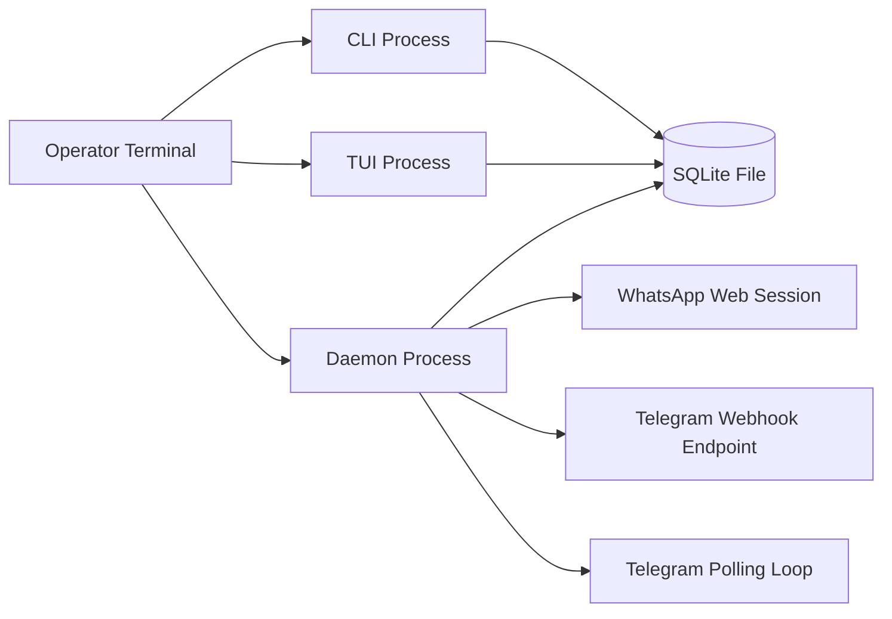

# Deployment and Runtime Modes

## Purpose

Illustrate local runtime processes and Telegram mode selection behavior.

## Source files

- `apps/daemon/src/index.ts`
- `apps/cli/src/index.ts`
- `apps/tui/src/index.ts`
- `src/transport/telegram.ts`

## Diagram

## Key invariants

- Telegram webhook mode takes precedence when webhook and polling are both enabled.
- Daemon is the only process that talks to OpenCode and transports.

## Failure modes

- webhook URL misconfiguration.
- local process manager restarts daemon without persisted config.

## Operational checks

- `npm run cli -- setup --dry-run`
- `npm run cli -- status`

## Related pages

- `docs/wiki/Operations/Onboarding-and-Setup.md`
- `docs/wiki/Integrations/Telegram.md`
