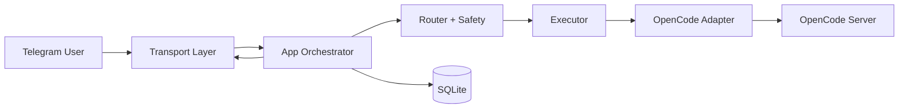

# End-to-End Guide

This is the deepwiki-style entrypoint for understanding, operating, and extending OpenCode Remote end to end.

## 1) System At A Glance



Primary code surfaces:

- App runtime: `src/index.ts`
- Router/safety/execution: `src/router/index.ts`, `src/safety/engine.ts`, `src/commands/executor.ts`
- OpenCode boundary: `src/adapter/opencode.ts`
- Transport: `src/transport/telegram.ts`
- State/persistence: `src/storage/sqlite.ts`, `src/access/controller.ts`

## 2) End-to-End Request Flow

1. Transport receives message/update.
2. App normalizes sender/body and checks dedupe key.
3. Access controller enforces allowlist/role constraints.
4. Router resolves intent (`prompt` or command namespace).
5. Safety engine applies shell/command guardrails.
6. Executor dispatches to adapter/store/access operations.
7. Adapter invokes OpenCode endpoints and normalizes output.
8. Formatter + transport send response back to origin channel.
9. Runs/audit/dead-letter state is persisted to SQLite.

Deep behavior docs:

- `docs/wiki/Integrations/Telegram.md`
- `docs/wiki/Security/Safety-Engine-and-Confirmations.md`

## 3) Operations Guide Path

Start here for live operation and incidents:

- `docs/wiki/Operations/Runbook.md`
- `docs/wiki/Operations/Troubleshooting.md`
- `docs/wiki/Operations/Retention-and-Maintenance.md`
- `docs/OPERATIONS.md`

Key runtime commands:

- `npm run verify`
- `npm run cli -- status`
- `npm run cli -- logs 50`
- `npm run cli -- flow 50`
- `npm run docker:redeploy`

## 4) Security Guide Path

- `docs/wiki/Security/Access-Control-and-Policy.md`
- `docs/wiki/Security/Safety-Engine-and-Confirmations.md`

Security defaults to understand first:

- owner/allowlist gate for all control actions
- dangerous command confirmation flow
- shell composition blocking in safety engine
- secret/db leakage prevention via pre-push guard

## 5) Media + Vision + ASR Behavior

- Voice/audio: local ASR transcription (`src/media/asr.ts`) then prompt.
- Images/PDFs: attached as prompt parts from Telegram media extraction.
- Vision routing: per-request override to `openai/gpt-5.3-codex` for image/PDF prompts.
- Fallback: one request-local retry with `opencode/big-pickle` for known unsupported Codex/account errors.

Related docs:

- `docs/wiki/Integrations/Telegram.md`
- `docs/COMMAND_MODEL.md`
- `README.md`

## 6) Architecture Index

- `docs/ARCHITECTURE.md`
- `docs/COMMAND_MODEL.md`
- `docs/DATA_MODELS.md`
- `docs/DATABASE_SCHEMA.md`
- `docs/ERD.md`

## 7) Contributor Guide Path

Suggested order for contributors:

1. `docs/wiki/Development/Monorepo-Structure.md`
2. `docs/ARCHITECTURE.md`
3. `docs/wiki/Development/Testing-Strategy.md`
4. `docs/wiki/Development/Quality-Gates.md`
5. `docs/COMMAND_MODEL.md`

Then run:

```bash
npm install
npm run verify
```

## 8) Change Hygiene (Definition of Done)

For behavior-changing work:

- update code + tests
- update command/ops/wiki docs
- update architecture and workflow wiki pages when flows change
- add changelog note under `Unreleased`
- pass `npm run verify`

Cross-check index: `docs/README.md`.
